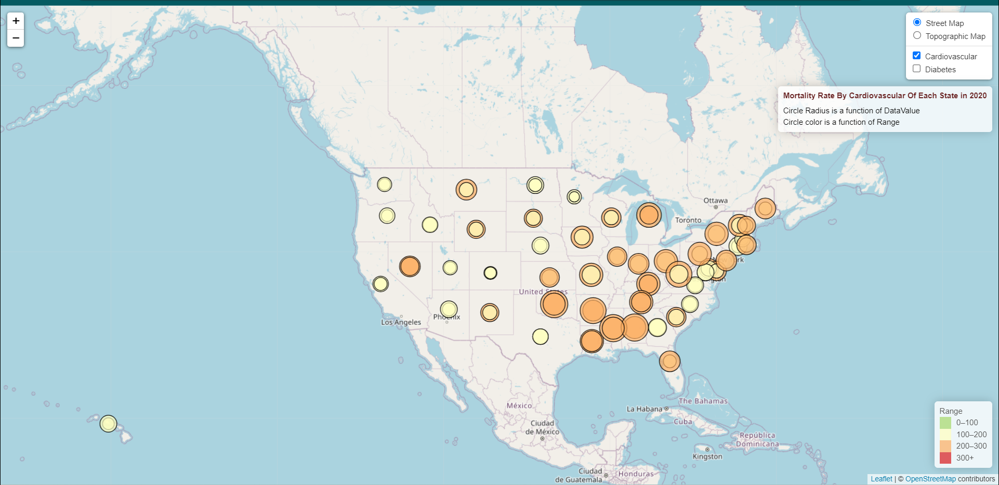
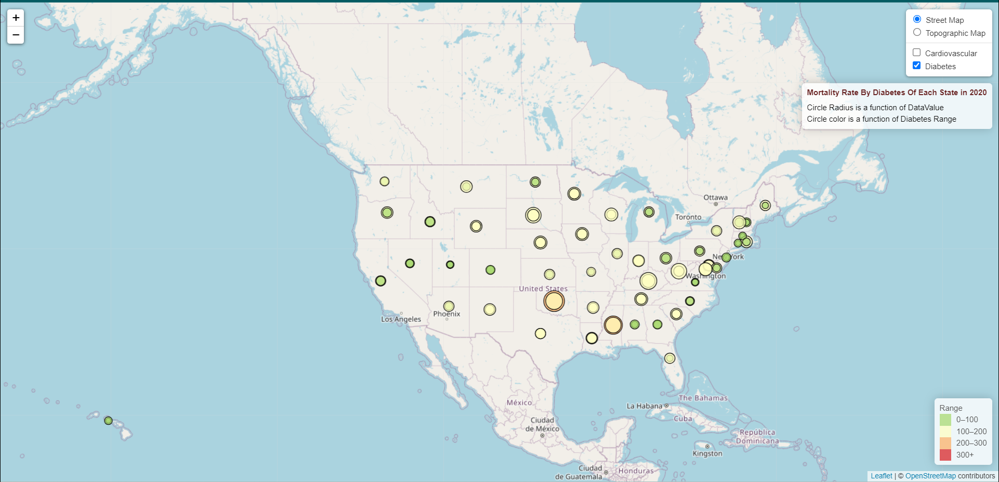

# Mortality Rates by Cardiovascular Disease and Diabetes in US States: A Visualization Project

This project aims to visualize and analyze data on chronic diseases in the United States using the U.S. Chronic Disease Indicators (CDI) dataset, available from the [Data.gov](https://catalog.data.gov/dataset/u-s-chronic-disease-indicators-cdi) website. The project utilizes Python, Flask, Leaflet, HTML/CSS, JavaScript, and a database (SQL, MongoDB, SQLite, etc.) to create an interactive data visualization dashboard.
## Project Overview
The objective of this project is to analyze and visualize state-wise mortality rates due to cardiovascular disease and diabetes for the year 2020. By leveraging the CDI dataset, we aim to provide meaningful insights into the prevalence of these chronic diseases across different states in the United States.
## Features
The project includes the following features:
1. Data extraction: The CDI dataset will be downloaded from the Data.gov website and processed to extract relevant information about mortality rates due to cardiovascular disease and diabetes for the year 2020.
2. Database storage: The extracted data will be stored in a database (SQL, MongoDB, SQLite, etc.) to enable efficient querying and retrieval.
3. Data visualization: The project will utilize Leaflet, a Python Flask-powered API, HTML/CSS, and JavaScript to create an interactive and visually appealing data visualization dashboard. The dashboard will display state-wise mortality rates on a map and provide various filtering and sorting options.
4. Interactive user interface: The dashboard will allow users to interact with the data visualization, including selecting specific states, viewing detailed information, and exploring different visual representations.

## Presentations
### Presentation Preparation and database management
BY EMILY CURLIN

### Visualization using Plotly
BY LAUREN PHELPS

### Visualization using Leaflet 
BY RUCHI CHANDRAWAL

Mortality rate by cardiovascular of each state in 2020
  

Mortality rate by diabetes of each state in 2020

#### Introduction
In this visualization project, we explore the mortality rates associated with cardiovascular disease and diabetes across the United States. By utilizing the Leaflet library, we have created an interactive map that provides a comprehensive overview of state-wise mortality rates and allows users to gain insights into the prevalence of these health conditions throughout the country.
#### Map Features
1. State-wise Mortality Data: The map showcases mortality rates for cardiovascular disease and diabetes across all 50 US states. Each state is color-coded to represent the severity of the mortality rate, enabling users to quickly identify areas with higher rates and potential health concerns.
2. Interactive Markers: By clicking on a specific state, users can access more detailed information about the mortality rates and associated statistics for cardiovascular disease and diabetes. These interactive markers provide a deeper understanding of the health landscape within each state.
3. Layer Controls: The visualization also includes layer controls, allowing users to toggle between cardiovascular disease and diabetes mortality rates. This feature enables a side-by-side comparison of the two health conditions and their impact on different states.

#### Implications and Benefits
By visualizing the mortality rates associated with cardiovascular disease and diabetes, this project aims to raise awareness about the prevalence and impact of these health conditions at a state level. The visualization can be beneficial for a variety of stakeholders, including researchers, policymakers, healthcare professionals, and the general public. It can assist in identifying regions with higher mortality rates, enabling targeted interventions, resource allocation, and public health initiatives to address the specific needs of each state.

#### Conclusion
The US State-by-State Mortality Rates Visualization offers an engaging and informative exploration of cardiovascular disease and diabetes mortality rates throughout the United States. Through interactive features, users can delve into the data, gain valuable insights, and contribute to a deeper understanding of the healthcare landscape across different states. By leveraging the power of Leaflet, this visualization provides a platform for data-driven decision-making and the promotion of better health outcomes across the nation.

### Comparison Of Ethnic Groups
BY STEVE TUTTLE

### Visualization By Using Bar Chart By Tye Smith
####  *Using D3 Diabetes mortality rate*

#### *Plotly Cardiovascular disease vs diabetes mortality rate*

### Flask API
BY TYLER WILLIAMS

[link to deployed Project 3 dashboard]https://lphelpspittman.github.io/Project_3/

## Contributors: 
* Emily Curlin (Emily.curlin@outlook.com)
* Lauren Phelps (laphelps08@outlook.com)
* Ruchi Chandrawal (Ruchichandrawal@gmail.com)
* Steve Tuttle (s_tuttle80@msn.com)
* Tye Smith (Tyesmith44@gmail.com)
* Tyler Williams (ntylerwilliams@gmail.com)

## Acknowledgement
We would like to express our gratitude to the U.S. government for providing the Chronic Disease Indicators (CDI) dataset and making it publicly available. This project would not have been possible without their efforts in collecting and publishing the data.

